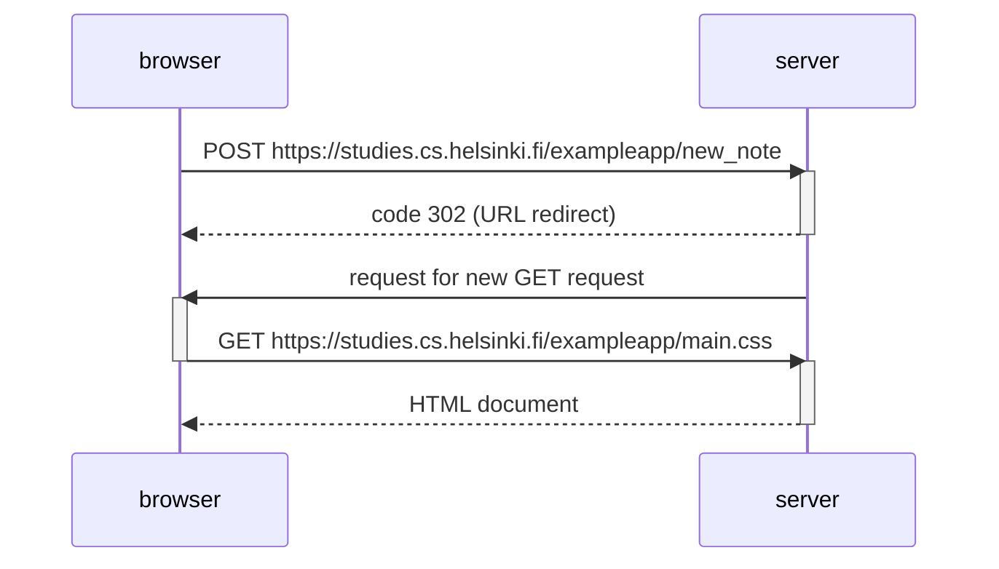
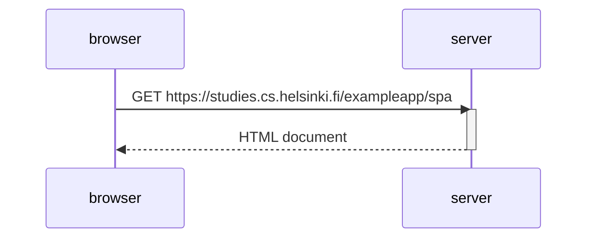
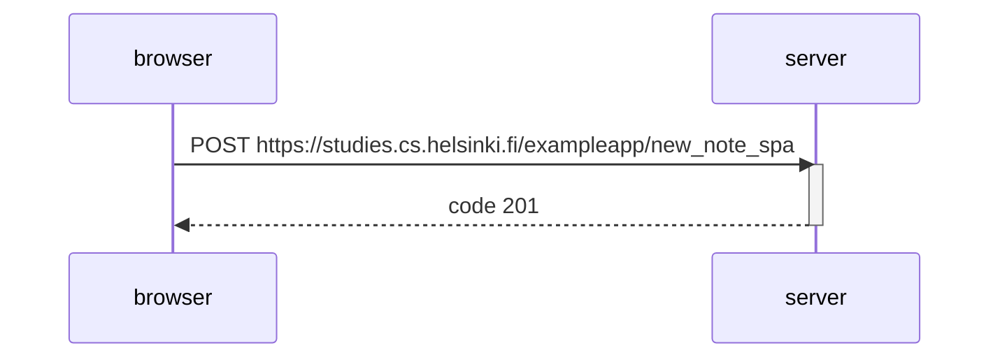

Sequence Diagram

```mermaid
sequenceDiagram 
participant browser
participant server

browser->>server: POST https://studies.cs.helsinki.fi/exampleapp/new_note
activate server
server-->>browser: code 302 (URL redirect)
deactivate server
server->>browser: request for new GET request
activate browser
browser->>server: GET https://studies.cs.helsinki.fi/exampleapp/main.css
deactivate browser
activate server
server-->>browser: HTML document
deactivate server
```

```mermaid
sequenceDiagram 
participant browser
participant server

browser->>server: GET https://studies.cs.helsinki.fi/exampleapp/spa
activate server
server-->>browser: HTML document
deactivate server
```

```mermaid
sequenceDiagram 
participant browser
participant server

browser->>server: POST https://studies.cs.helsinki.fi/exampleapp/new_note_spa
activate server
server-->>browser: code 201
deactivate server
```